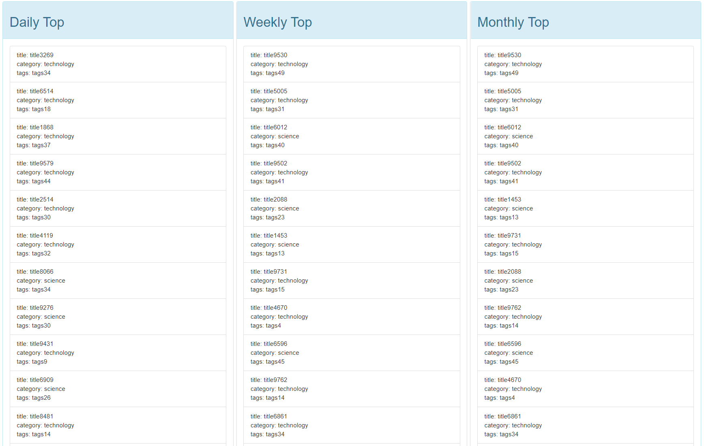
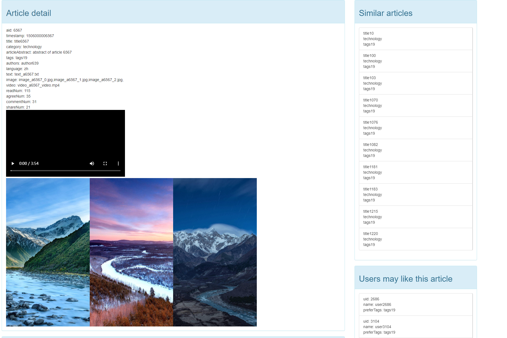
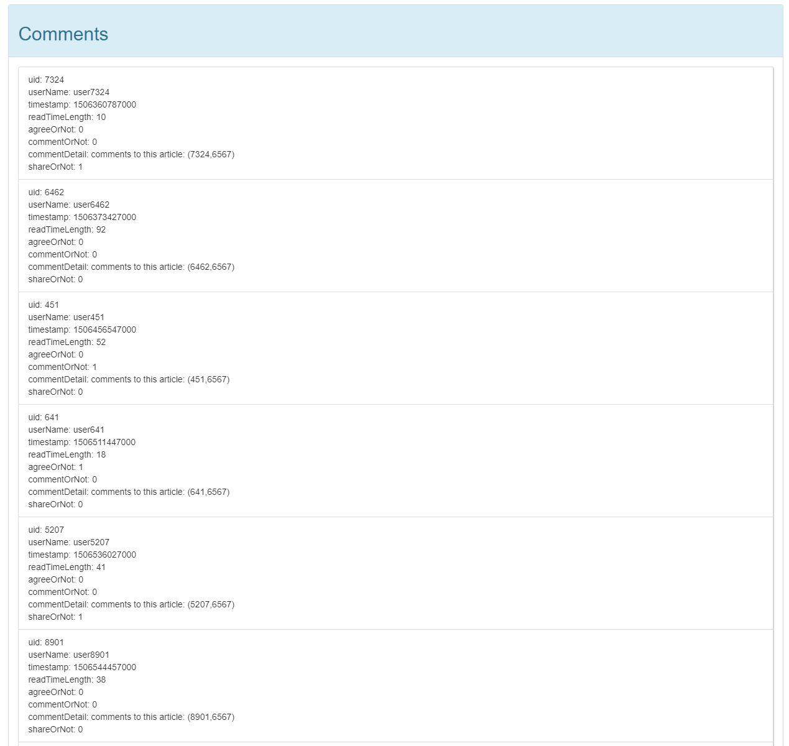
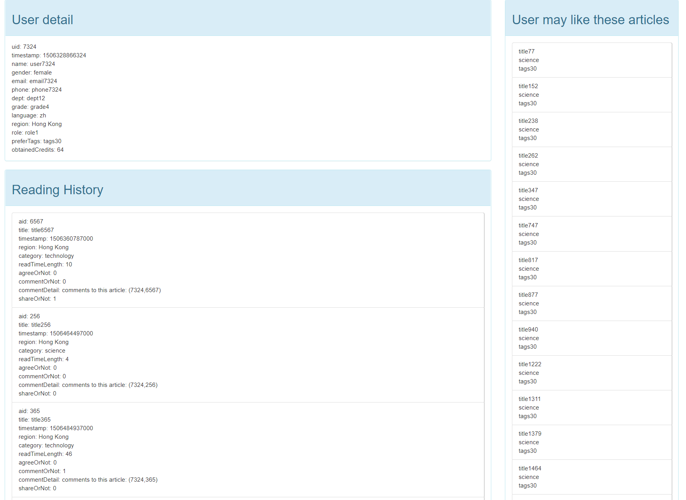

# DDBMS 课程项目报告

## 摘要

在大数据背景下，分布式数据库系统已成为各种应用的基石，不仅提供了高效的大数据量存储，还保障了数据的可靠性、安全性等。本文针对作业要求的图书阅读这一场景，基于各类分布式数据库系统搭建了一个 Web 应用，主要使用 MongoDB^[1]^ 存储结构化数据，使用 HDFS^[2]^ 分布式文件系统存储非结构化数据，并使用 Redis^[3]^ 进行数据缓存加速查询速度。 该应用的所有组件都基于 Docker^[4]^ 进行了容器化，能够很好地适配分布式场景，适应云原生的大趋势。

## 背景与动机

信息化社会的到来导致了数据量急剧膨胀，衍生出了大数据这样一个革命性的概念，对大数据的保存与挖掘能够帮助科学探索、提高商业生产力并促进人类进步^[5]^。大量增加的数据自然需要新的技术来进行管理，这就导致大数据和分布式成为了密切相关的两个名词，可以说正是分布式推动了大数据时代的到来。

大数据的特点符合以下描述的 5V 模型：

* 海量 Volume：数据在采集，存储，处理，分析等各个环节的体量都很大，是远超传统数据库系统存储极限的海量数据集合。
* 高速 Velocity：数据增长速度快，数据以指数的速度增长，需要在相对较短的时间窗口内采集、存储、处理和分析数据。
* 多样 Variety：数据类型和来源复杂，数据既可以是结构化，也可以是非结构化的，可以是文本、音频、视频、图像、数据日志等。
* 低价值密度 Value：单位数据的价值低，即海量信息中的价值密度相对较低，这就要求有一套系统性的方法从大量数据中提取有价值的信息。
* 准确性 Veracity：数据质量参差不齐，收集到的信息的准确性难以确定。

本文针对图书阅读这一场景，使用分布式大数据系统搭建了一套完整的业务系统，用于存储和处理海量图书阅读数据。通过该项目，我们了解如何通过分布式技术来管理大数据，并解决现实世界中的相关问题。

## 问题定义

给定如上图所示的表关系，其中 User、Article 和 Read 表是已知表，Be-Read 和 Popular-Rank 表需要通过计算生成，每个表需要包括以下字段并满足要求的数据分布：

* User (id, timestamp, uid, name, gender, email, phone, dept. grade, language, **region**, role, preferTags, obtainedCredits)：根据 region 字段水平分片，region=”Beijing” 位于 DBMS1，region= “HongKong” 位于 DBMS2。
* Article (id, timestamp, aid, title, **category**, abstract, articleTags, authors, language, text, image, video)：根据 category 字段水平分片，category=”science” 位于 DBMS1 and DBMS2，category=“technology” 位于 DBMS2。
* Read (id, timestamp, uid, aid, readTimeLength, aggreeOrNot, commentOrNot, commentDetail, shareOrNot)：和 User 表的分片方式相同。
* Be-Read (id, timestamp, aid, readNum, readUidList, commentNum, commentUidList, agreeNum, agreeUidList, shareNum, shareUidList)：和 Article 表的分片方式相同。
* Popular-Rank (id, timestamp, temporalGranularity, articleAidList)：根据 temporalGranularity 字段水平分片，temporalGranularity=“daily” 位于 DBMS1, temporalGranularity=“weekly” 或 “monthly” 位于 DBMS2。

实现分布式环境下的一个数据中心，需要实现以下功能：

1. 在考虑数据分区、多副本的情况下批量载入数据
2. 高效地执行数据插入、更新与删除
3. 监控 DBMS 的运行状态，包括数据量、数据位置、工作负载等

## 相关解决方案

### MySQL Cluster

MySQL Cluster^[6]^ 是基于 MySQL 数据库管理系统提供了无共享集群和自动分片功能，可以在保持低延迟的同时提供高可用性和高吞吐量，同时允许近乎线性的可扩展性，是一个适合于分布式计算环境的高实用、高冗余版本。MySQL Cluster 是通过 MySQL 的 NDB 或NDBCLUSTER 存储引擎实现的，允许在 1 个 Cluster 中运行多个 MySQL 服务器，其中MySQL 集群管理器将负责调整每个集群并提供具有最高可用性的查询结果。

### MongoDB Sharding

MongoDB 通过水平分片来支持多机器的水平扩展，能够支撑大数据集和高吞吐量操作的分布式环境，MongoDB 分片集群包括以下三个部分：

* shard server：每个分片服务器包含一部分分片后的数据，每个分片可以被部署为一个副本集。
* config server：存储集群中的元数据和配置信息。
* mongos：可以将 mongos 视作查询的路由中心，提供了客户端程序和分片集群之间的交互接口。

使用 MongoDB Shading 有以下三种优点：

1. 读/写性能高：集群可在分片服务器之间均衡读写工作负载，允许每个分片服务器处理集群操作的子集。可以通过添加分片服务器来水平扩展工作负载。
2. 存储容量大：水平分片将数据分布到集群中的各个分片服务器上，每个分片包含整个集群数据的一个子集。随着数据集的增长，额外扩充分片服务器可以增加集群的存储容量。
3. 可用性高：通过副本集的方式来部署分片服务器和配置服务器能够大幅提高集群的可用性。

### Hadoop Distributed File System

HDFS (Hadoop Distributed File System) 是基于Google发布的GFS论文设计开发，可以运行在通用硬件上的分布式文件系统。除了具备其他分布式文件系统相同的特性外，HDFS还具备如下的特有的特性：

1. 高容错性：HDFS的设计理念即认为硬件总是不可靠的，因此充分考虑了硬件故障情况。
2. 高吞吐量：HDFS支持高通量、流式数据访问。
3. 大文件存储：HDFS支持TB级乃至PB级规模的数据存储。

HDFS的架构包含三个主要部分：

1. NameNode：用于存储、生成文件系统的元数据。
2. DataNode：用于存储实际的数据，运行时会将自己管理的数据块上报给NameNode。
3. Client：支持业务访问HDFS，从NameNode、DataNode获取数据返回给业务端程序。

从HDFS的架构特性中可以看到，HDFS针对大规模、非结构化数据的管理可以提供十分优秀的支持效果。但是对于细粒度的、结构化的数据的管理，其运行机制存在很多累赘之处，使得性能难以达到生产级的要求。

### Redis

Redis是目前最流行的NoSQL数据库之一，是一款包含多种数据结构、支持网络、基于内存、可选持久性的键值对存储数据库。Redis具备如下特性：

1. 采用key-value型存储引擎
2. 支持分布式部署，具备高可扩展性
3. 基于内存运行，性能高效
4. 采用单进程单线程模型的同时支持高并发读写

从Redis的特性可以看出，Redis针对热点数据的缓存可以提供十分优秀的支持，但是其持久化的特性也仅局限于键值型数据的管理，对于关系型的交易事务、结构化的数据并不能提供性能充分的持久化管理。

## 方案描述

### 系统架构

系统架构图如下所示：

* SpringBoot 搭建的 App
* 一个 Redis
* 一个 HDFS集群
* 一个MongoDB 分片集群

### 模块描述

#### MongoDB Sharding

使用副本集 Replica Set 模拟不同的 DBMS，DBMS1 和 DBMS2 各为一个副本集。由于部分数据可以同时存在于 DBMS1 和 DBMS2 上，所以使用 Zone 来代表数据的存储位置，共创建了三个 Zone，分别指代 DBMS1、DBMS2、DBMS1-2，将不同的 Zone 指定为分片的目标地址。

通过 mongoimport 工具直接导入 .dat 文件，生成 User、Article 和 Read 表。数据导入成功后，通过数据管道生成 Be-Read 表和 Popular-Rank 表，其中 Popular-Rank 表中的 article 得分公式如下所示：agree * 3 + comment * 2 + share * 2

通过 MongoDB Compass^[7]^ 和 mongosh 下的 sh.status() 命令共同监控 MongoDB 分片集群的数据量、数据位置和工作负载。

#### HDFS

依据 HDFS 的特性，系统采用 HDFS 来存储非结构化的大文件，主要支撑业务中的图片和视频访问。HDFS 的部署方案为一个 NameNode 和三个 DataNode，HDFS中存储的文件均以三副本的方式支持容错性。

考虑到HDFS的数据读写方式，客户端若部署在宿主机中且仅以端口映射的方式访问 Docker 容器中的 HDFS 集群，则由于 NameNode 会返回一个 DataNode 的 IP 地址给客户端，客户端将无法通过 Docker 虚拟网络的 IP 地址访问指定的 DataNode。因此在部署时，将 HDFS 集群的容器与 App 程序的容器共同接入同一个 Docker 网络，这样 App 程序即可通过 IP 地址访问 DataNode 并读写数据。这也使得系统的其他组件的容器也将被接入这个网络。

为了将宿主机内生成的数据上传到 HDFS 集群的容器中，部署时采用卷映射的方式将宿主机的目录映射到容器内的某个目录，然后在容器内执行 HDFS 的文件上传命令，将映射目录里的数据上传到 HDFS 上。

#### Redis

基于 Redis 的特性，系统采用 Redis 实现结构化数据的缓存功能。得益于 Spring Data 良好的生态，以 SpringBoot 为主要技术栈搭建的服务端程序可以很容易地集成 Redis 程序并自动实现缓存访问逻辑。

由于内存中的结构化数据均以对象的方式进行存储和使用，因此在缓存只 Redis 时需要做数据类型上的转换和处理。在使用 Redis 缓存时，以 MongoDB 的访问类加上具体函数名作为缓存键，以对象序列化出的 Json 格式的字符串作为缓存值，这样即可支持任意单个对象以及对象数据的缓存和访问。

#### App

系统采用 SpringBoot 实现服务端程序，整合 MongoDB、HDFS 以及 Redis，向前端提供数据访问与页面访问服务。

采用经典的 Html5、Css3 和 JavaScript 语言以及轻量级的 BootStrap 框架实现浏览器端的 Web 页面。

结合系统数据的特点，我们为App程序做如下的功能设计。由于数据主要为文章的具体信息、读者的具体信息以及读者对文章阅读和评论等记录，因此可以假设该数据应源于类似公众号或图书馆运营性质的平台，主要向管理员提供多角度的文章与读者视图，以支持管理员更好地进行文章推送的分析与决策。因此定义如下功能：

1. 文章热榜功能，包括日榜、月榜和年榜
2. 文章详细信息查阅功能，支持查看文章所有的详细信息以及评论信息
3. 读者详细信息查阅功能，支持查看读者所有的详细信息以及阅读记录
4. 相似文章发掘功能，支持查询相同类别和标签的文章
5. 目标读者发掘功能，基于文章标签推测哪些读者会喜欢这篇文章，即支持按标签查询读者
6. 文章推荐功能，基于读者喜欢的标签进行文章查询，作为向该读者推荐的结果

## 方案评估

### 功能展示

#### 文章热榜功能

#### 文章主页

#### 读者主页

### 性能评估

针对系统的各个组件与功能的测试结果如下表所示，可以看到Redis对于热点数据的性能优化具有显著效果。

| 功能                                     | 数据量 | 总耗时 |
| ---------------------------------------- | ------ | ------ |
| HDFS上传图片、视频和文本数据             | 10G    | 1h     |
| MongoDB导入结构化数据                    | 265M   | 1min   |
| App页面信息访问速度                      | 10K    | 0.75s  |
| redis缓存命中情况下的App页面信息访问速度 | 10K    | 0.25s  |

## 结论与未来展望

本文针对结构化、非结构混和的大规模数据业务场景，在分析现有系统的特性的基础上，通过集成MongoDB、HDFS和Redis三款数据管理系统各自的优势，搭建了一站式的分布式数据管理系统。在系统搭建的基础上，针对业务数据设计了数据应用，通过Springboot技术搭建了服务端程序，基于Html5、Css3、Javascript以及Bootstrap框架实现了浏览器端的web页面。本文搭建的数据系统与应用程序为用户提供了良好的、易用的、可用的数据管理方式与访问方式。

本文的工作主要集中在数据集成与展示，对于数据分析并未提供更多的支持。在未来的工作中，可以考虑基于数据仓库或图数据库提供更多的分析性功能，增强数据系统的数据管理能力。

## 参考文献

1. MongoDB (https://www.mongodb.com/)
1. Hadoop HDFS (https://hadoop.apache.org/)
1. Redis (https://redis.io/)
1. Docker (https://www.docker.com/)
1. P. V. Desai, "A survey on big data applications and challenges," 2018 Second International Conference on Inventive Communication and Computational Technologies (ICICCT), 2018, pp. 737-740, doi: 10.1109/ICICCT.2018.8472999.
2. MySQL (https://www.mysql.com/)
2. MongoDB Compass (https://www.mongodb.com/products/compass)
